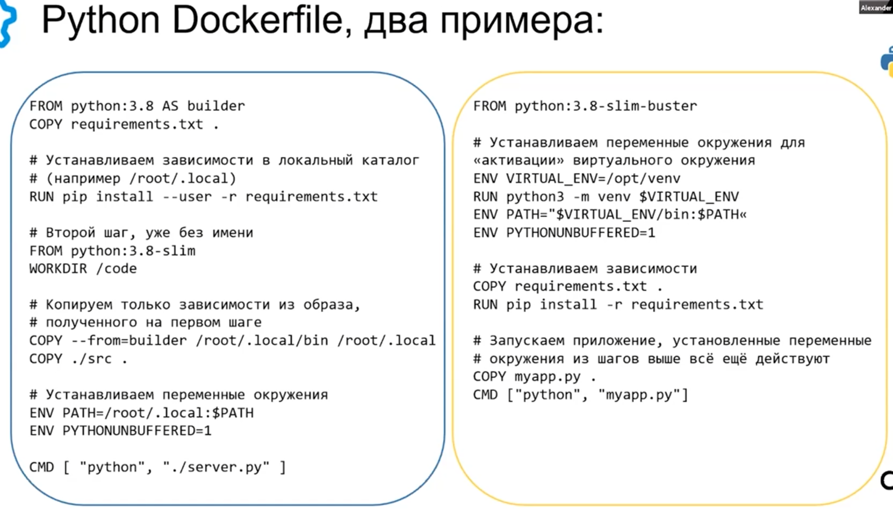

Всегда указываем точные версии пакетов в поле FROM и в requirements.txt
Сначала должны идти зависимости requirements.txt, а затем COPY для кода (или bind mount Для 
локальной разработки)

Переменная PYTHONUNBUFFERED: 1 слудит для упрощения отладки, это не буфферизирует вывод, а 
вываливает логи в контейнере без задержек и если приложение упадет, это исключит, что часть 
вывода останется в буффере

Если очень нужен virtualenv - в докере используем ENV, хотя в контейнере не рекомендуется 
использовать virtualenv

Памятка по gunicorn
    gunicorn --worker-tmp-dir /dev/shm -перенос tmp в RAM
    gunicorn --worker=2 --threads=4 --worker-class=gthred - два воркера, если присутствуют 
медленные ответы, например в БД не оптимизированы запросы
    gunicorn --log-file=... пищшем логи в STDOUT
Рассмотрим пример

