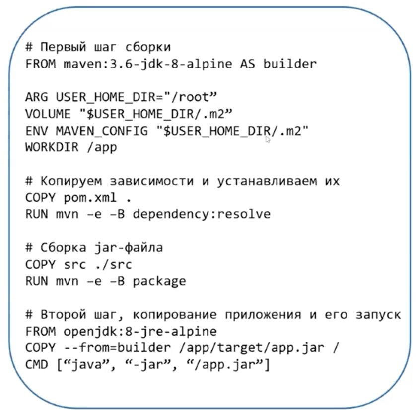

Java до версии 8u121 не понимала cgroups и могла использовать все лимиты хоста не смотря на 
лимиты контейнера, поэтому обязательно выставляйте квоты при запуске

Для сборки используем maven, а для запуска openjdk или Zulu и др. и не надо держать их в одном 
контейнере.
Подключайте тома для переиспользования кеша сборок, чтобы между преезапусками сборок это все 
где-то хранилось
Ограничивайте размер кучи (-Xmx, -XX:MaxRampPercentage)
Но контейнеру давайте на 25% больше

Пример

