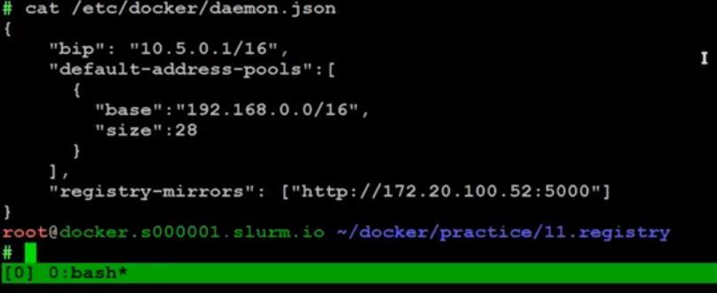

# Введение и демонстрация работы с registry-зеркалом

Ограничения Докер:
- анонимы могут лишь отправить 100 запросов на получения образов каждые 6 часов
- авторизованные пользователи, бесплатная учетка - 200 запросов

Обойти эти ограничения очень просто
'''
docker run -d registry
'''
А вот реальная команда
'''
docker run \
    -d \
    -p 5000/5000 \
    --restart=always \
    --name=mirror \
    -e REGISTRY_PROXY_REMOTEURL="https://registry-l.docker.io" \
    registry
'''
загрузим что-нить из этого режистри
'''
docker pull 127.0.0.1:5000/library/debian
'''

а вот что прописалось в настройках

Допустим у нас есть приложение, соберм его
'''
docker build -t my-app:1.1 .
'''
а теперь запушим его
'''
docker push my-app:1.1
'''
Видим, что по умолчанию Docker хочет использовать Docker Hub.
