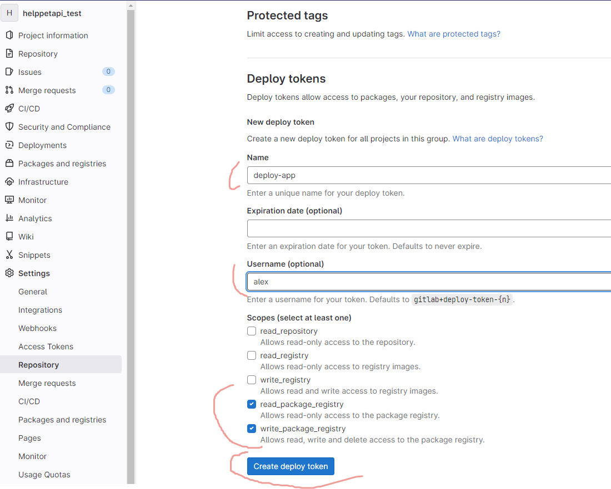
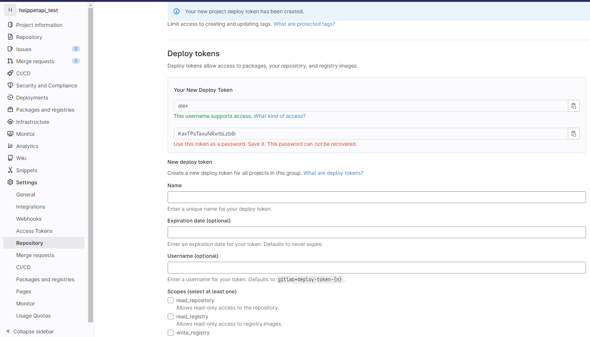

# 3. Практика работы со своим registry на примере Gitlab

registry от Docker слишком простой, напр там нет авторизации

Единственное его применени, чтобы обходить ограничения докер на скачивание образов.
Можно использовать Gitlab в качестве registry

Логинимся в Gitlab registry и пушим туда

    Создаем новый пустой проект в Gitlab

https://gitlab.com/alex/my-app

Обязательно назовите его app, чтобы не править команды ниже.

    Создаем project access токен в Gitlab
Тут возмоны три варианта
1. Слева меню -> внизу Settings -> Deploy token

нажимаем создать и нам выдает имя и токен

2. Access Tokens который личный, действует на все проекты, в остальном все тоже самое как и 3-й
3. Access Tokens конкретного проекта, его мы и будем использовать

Если создание Access Tokens заблокировано, то его можно включить
Чтобы включить или отключить создание токена доступа к проекту для всех проектов в группе верхнего уровня:
 - На верхней панели выберите Главное меню > Группы и найдите свою группу.
 - На левой боковой панели выберите «Настройки» > «Основные» .
 - Разверните Разрешения и групповые функции .
 - В разделе «Разрешения » включите или выключите параметр «Разрешить создание токена доступа к 
   проектам и группам ».

Слева меню -> внизу Settings -> Access Tokens

https://gitlab.com/alex/my-app/-/settings/access_tokens

Name - любое имя (например docker-token)
Scopes - read_registry, write_registry

Токен нужно обязательно сохранить, тк его больше не увидеть!

    Переходим в терминал со стендом и пытаемся залогиниться:

docker login registry.gitlab.com
# вместо логина вводите что угодно, пароль - из токена на предыдущем шаге

> Важно, токен будет храниться в файле docker/config.json
> ниже он предлагает ссылку на инструкцию, как можно его перенести в другое место, чтобы не 
> хранить в одкрытом виде

Теперь мы можем туда что-нибудь отправить на хранение. Соберём образ:

docker build -t registry.gitlab.com/s000001/app:gitlab .

И отправим его пылиться на склад:

docker push registry.gitlab.com/s000001/app

Как видим, по умолчанию Docker ищет тэг latest. Давайте его добавим к образу:

docker tag registry.gitlab.com/s000001/app:gitlab registry.gitlab.com/s000001/app:latest

И теперь заново запушим.
Можете использовать ключ --all-tags для того, чтобы в registry попали все тэги образа.

Если всё сделано правильно, мы сможем убедиться, что он доехал куда нам было нужно - откроем в браузере Gitlab и посмотрим:

https://gitlab.gitlab.com/s000001/xpaste/container_registry

Если мы захотим использовать другой Access Tokens, то нам сначала  нужно удалить файл (или в 
этом файое предыдудщий токен)
'''
rm - f /root/.docker/config.json
'''
