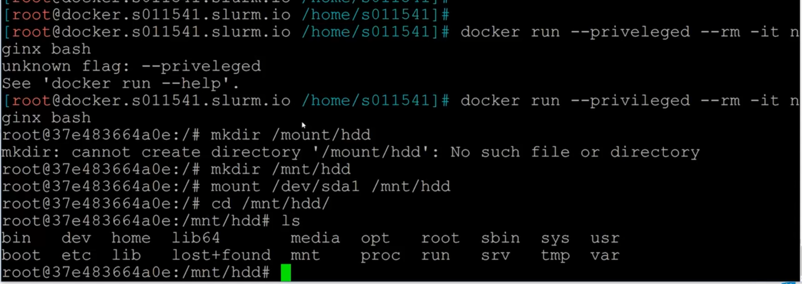
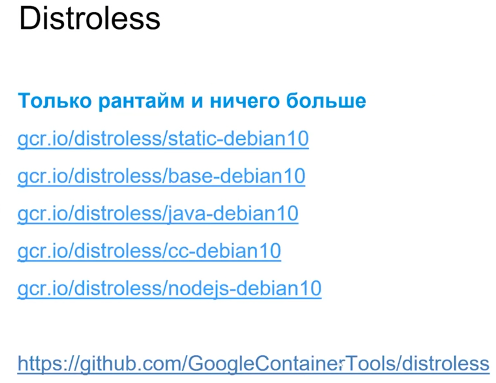
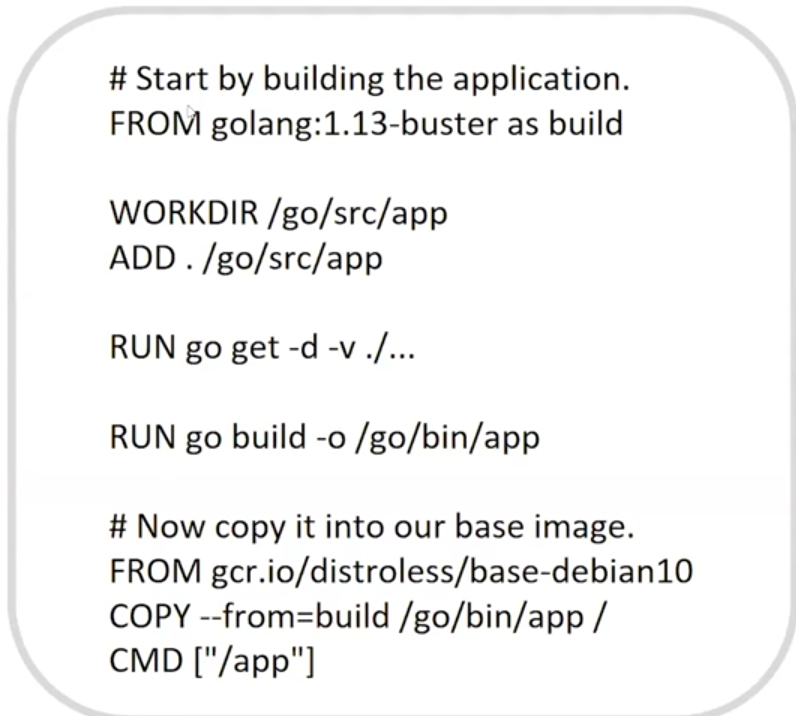
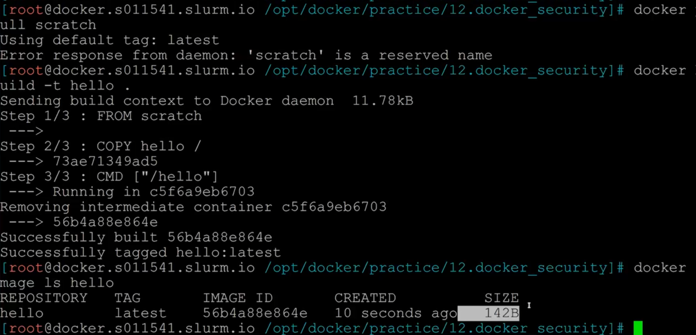

# 12. Безопасность в Docker

Контейнеры хоть и изолированы, но все равно они используют общие ресурсы

Если на хосте проблемы с безопасностью, то про докер можно и не говорить
Требования к хосту:
- надежные пароли
- минимальные права
- минимум ПО, желательно кроме докера ваще ни чего не ставить, а если что совсем нужно то 
  запускать в контейнерах
- Линуксовая безопасность SELinux/AppArmor (это сложно и мало кто умеет)
- файрволы и т.д.

Возможные уязвимости:
- нет идеального ПО
- серьезные уязвимости встерчаются на много чаще, чем многие думают

Самый главный совет- это чаще ставить обновления, хотя многие и не любят этого
При этом новые верисии тоже могут принести новые уязвимости, но тут надо иметь ввиду, что новая 
уязвимость всегда лучше, чем всем уже известная старая

Другие советы:
- не использовать UID 0 (root) в контейнерах, т.к. через него могут получить root на хосте, на 
  самом деле, root почти ни когда и не нужен в контейнере, как поменять пользователя в 
  контейнере см. в файле change-user-docker.md 
- Не использовть образы, которым не доверяем, надо иметь ввиду, что Docker-hub Это помойка, 
  любой может залить туда свой образ, поэтому стоит смотреть, что находится в контейнере, а еще 
  лучше есть есть репа, где видно как он собирается или как минимум посмотреть Dockerfile. А 
  самый лучший вариант самому собрать образ из исходников репы. Так же рекомендуется 
  использовать офф образы
- использовать статические и динамические анализаторы
  - статические Clair, встраиваются в pipeline
  - динамические Falco, это практически антивирус, который встраивается в процессы в контейнеры
  - и все вместе snyk только уже платный
- Есть еще линтеры, которому можно дать на анализ Dockerfile и он его проверит, но только больше 
  на уровне синтаксиса

Capabilities (возможности) - которые дает докер иногда они тоже избыточны
А прилегированные контейнеры - это очень плохо
```
Docker run Image --priveleged
```
Фактически мы запускаем от рута чужой код
В идеале лучше осталять только нужные Capabilities, отключая остальные
cap-drop=all отключает все Capabilities
cap-add=setuid разрешаем задавать uid 
cap-add=setgid разрешаем задавать groupid and userid
```
docker run -d --cap-drop=all --cap-add=setuid --cap-add=setgid fedora 
```
Вот хороший пример того, что можно сделать имея привелигированный контейнер

Мы видим, что таким образхом получаем доступ к хосту причем от рута и можем там делать все что 
угодно.

Старайтесь, что бы в контенере было как можно меньше приложений
Distroless - это минимальные контейнеры в которых нет ни чего лишнего, нет баша, нет шелла, нет 
даже apt. Мы туда даже зайти не сможем, но с другой стороны а зачем на проде это все нужно?
Тут приведены список примеро с Distroless

Вот пример как можно собрать свой distroless, тут мы собираем go-й код в go-м контейнере, а 
затем просто бинарник помещаем в готовый  distroless контейнер, в итоге получаем distroless 
контейнер со своим приложением.

Это работает , тк если в контейнере два FROM, то все что было впервом будет удалено и не попадет 
в образ, во втрой мы только можем перекинуть какмие-то файлы, артефакты из первого

Можно так же использовать alpine или debian

Scratch - это скорее не контейнер а котодое слово, но из него можно собирать контейнеры, самые 
маленькие, в которых кроме исходников ни чего нет
```
FROM scratch
```
Вот в этом примере мы собиарем ассемблерынй файл в контейнер и видим, что размер контейнера 
равен размеру бинарника

Использовать scratch стоит только в редких случаях, например если это банк, т.к. это очень муторно

Другое дело dev среда, там эти рекомендации совсем не нужны, там как раз требуется ПО для 
диагностики, тестирования и др

## Подписанные контейнеры - цифровая подпись
Если мы выполним команду, то мы будем видеть только контейнеры с цифровой подписью, т.е. мы не 
сможем пулить не подписаныые контейнеры.
```
sudo expert DOCKER_CONTENT_TRUST=1
```
Каждая подпись отдельно для каждого тэга

### Еще одна рекомендация - ни когда не тащите в контейнер ssh

