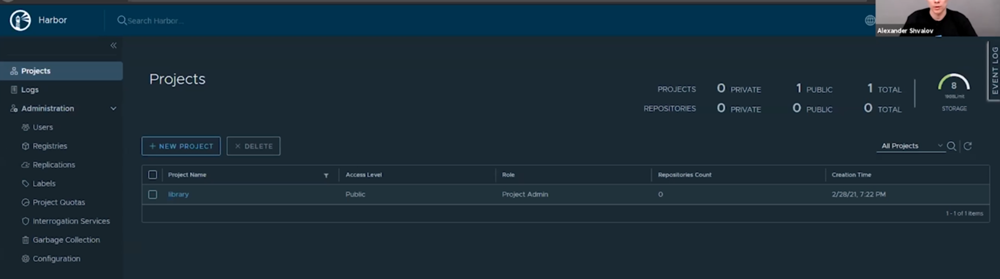

# 5. Обзор интерфейса и возможностей Harbor

Вот как выглядит интерфейс harbor

Тут очень много настроек, можно заводить пользователей с разными ролями, указывать квоты для 
каждого проекта и т.д. Очень удобная штука для создания локального registry
