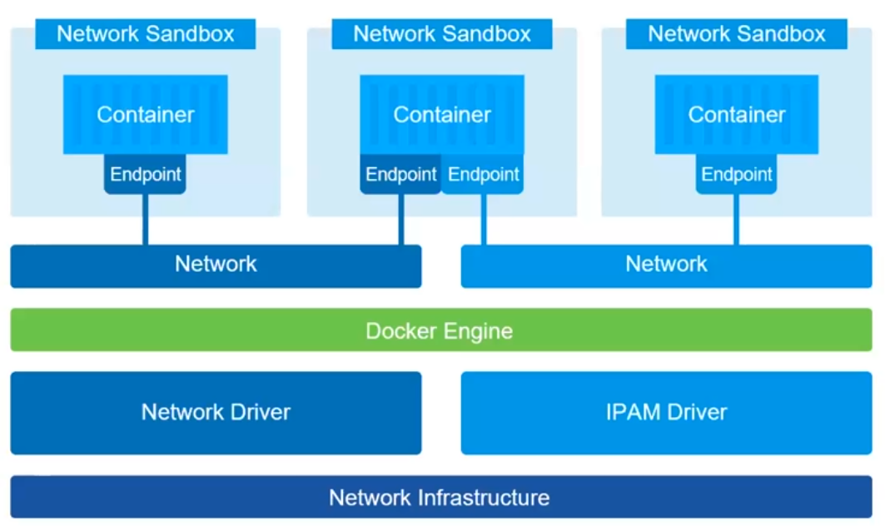
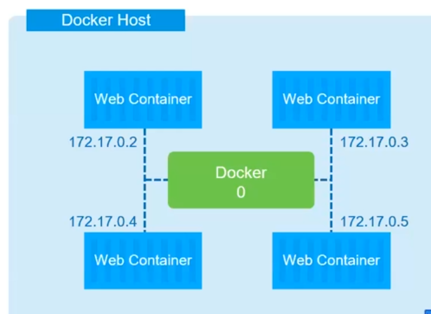
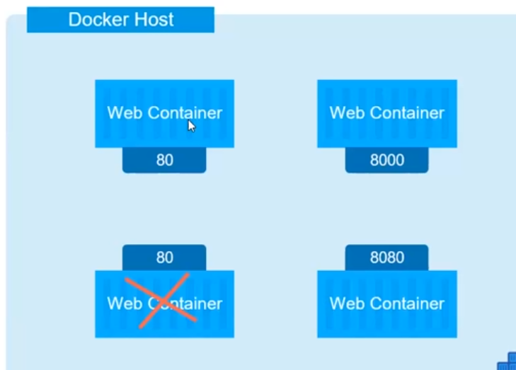
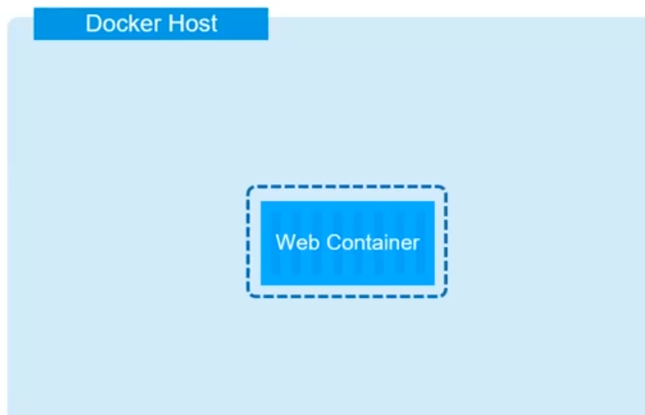
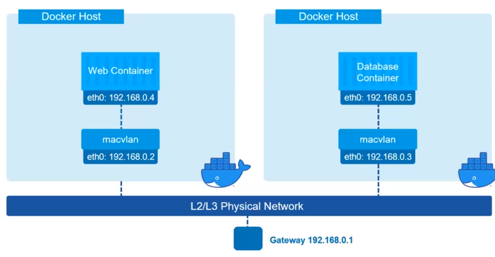
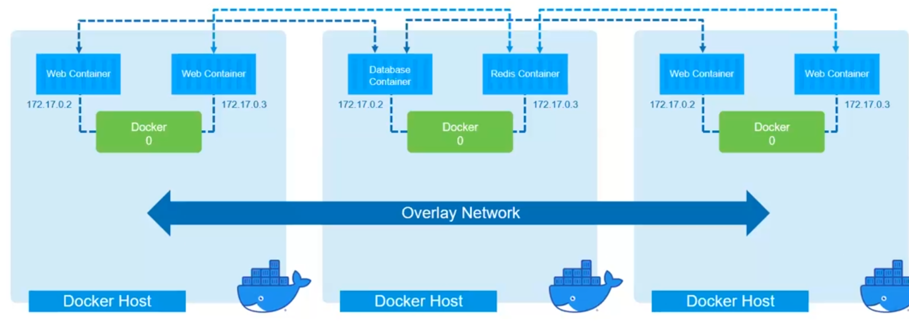

## Сети в докере

Докер работает в сетовой песочнице, изолированно от хоста

Для связи с внешним миром есть Endpoint, который связан с сетью хоста, как прпвило подключается 
Bridge
IPAM драйвер, предоставляет адреса нашим контейнерам

По умолчанию получаем следующую сеть,

сетевой дарайвер работает в режиме Bridge, его суть в том, что при запуске докера создается 
интерфейс с названием Docke0 и все контейнеры, которые запускаются по дефолту подключаеются к 
нему и для выхода в интеренет они отплавляют свои пакеты через bridge

Второй вариант, когда контейнер будет использовать сеть хоста, networ draver= Host

В этом случае он будет видеть все сетевые интрефейсы хоста и может занять любой порт. Но это 
черевато дву вещами мы не можем запустить еще одни контейнер на этом же порту (в пример 80), т.к.
он уже занят. А второй момент это не очень безопасно, т.к. мы свое приложение выставляем наружу 
и этот вариант не очень хорош. Это нужно только если надо, чтобы приложение было доступно на 
ip-адресе хоста

## networ draver= None

Когда мы совсем не подлключаем ни какую сеть. В этом случае мы не сможем подключиться снадружи к 
конетйнеру. Это используется ,когда в контейнере запускается что-то совсем безопвсное.

## networ draver= Macvlan

Этот вариант бывает необходим когда нам надо чтобы контейнер имел реальный адрес, как будто он 
присутсвует на нашей сети. Например когда берем какой-то легаси проект, в котором это требуется 
и нам надо как то это реализовать. Использовать вариант с хостом не безопасно, вот тут и помоежт 
режим  Macvlan.
А так он используется очень редко

## networ draver= overlay

Это когда мы растягиваем сеть докера на несколько демонов

Эта штука работает со Docker-swarm, который особо не получил популярности, а больше используется 
кубернайт.

